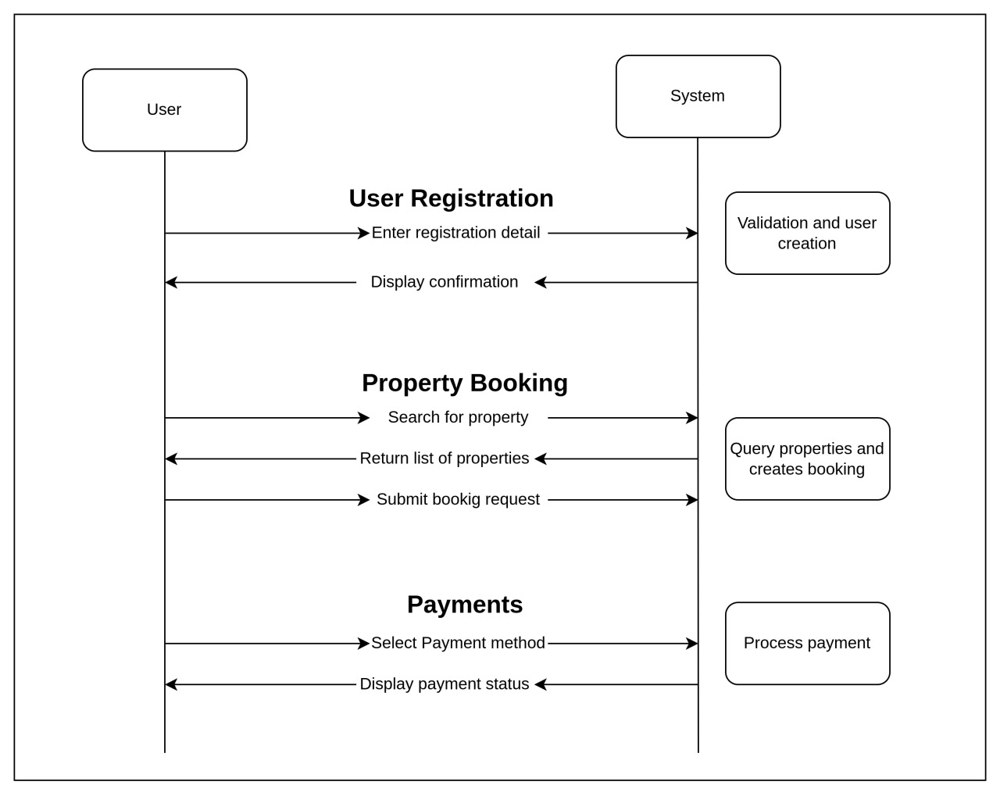

# 🏡 Airbnb Clone Backend - Use Case Diagram of the Features and Functionalities

## 📚 Overview

This document outlines use case diagram that visualizes the interactions between users and the system for key functionalities like user registration, property booking, and payments.

---

## Use Case Diagram

